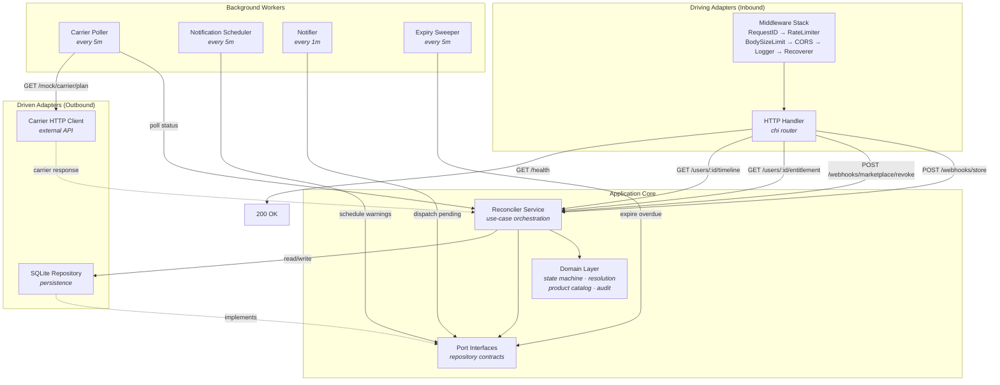
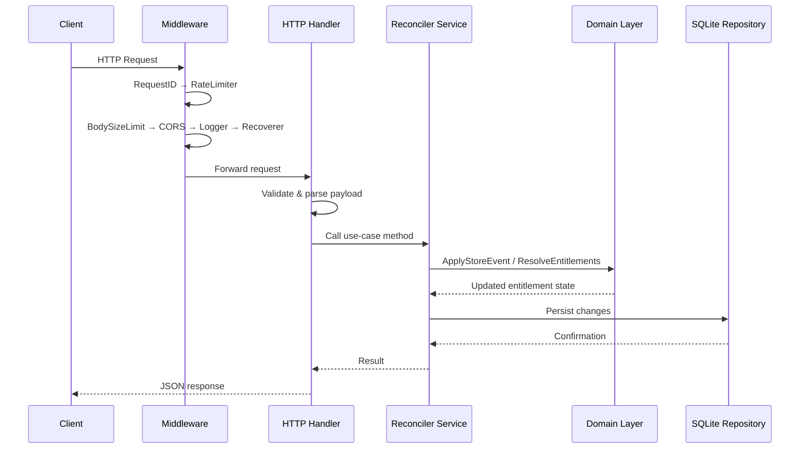
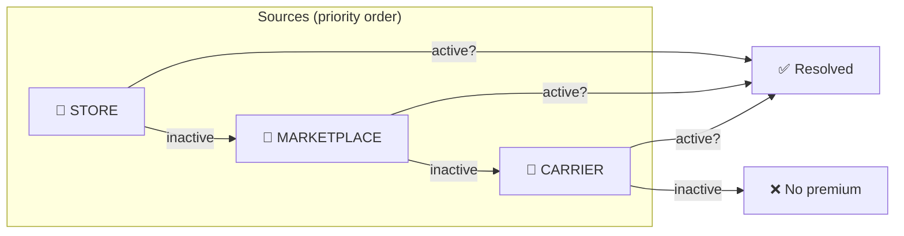
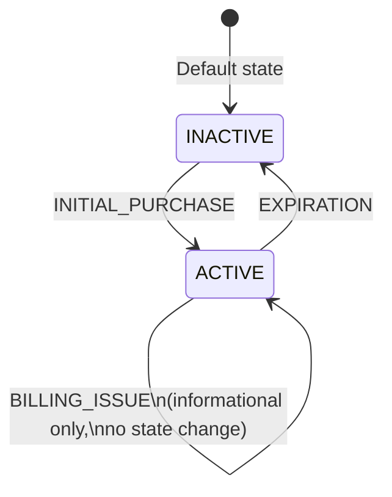
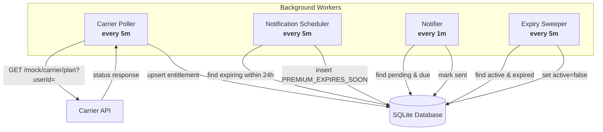
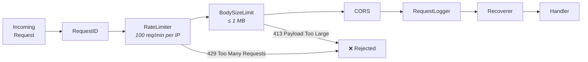

# Subscription Reconciler

Premium entitlement reconciler for multi-channel subscription management. Ingests signals from in-app store (webhooks), mobile carrier (polling), and third-party marketplace (bulk revoke) to maintain canonical premium access state per user.

<p align="center">
  
  
  
  
  
</p>

<p align="center">
  
  
  
  
  
  
  
</p>

---

## Table of Contents

- [Overview](#overview)
- [Quick Start](#quick-start)
- [Architecture](#architecture)
- [API Reference](#api-reference)
- [Domain Model](#domain-model)
- [Database Schema](#database-schema)
- [Background Workers](#background-workers)
- [Middleware Stack](#middleware-stack)
- [Configuration](#configuration)
- [Testing](#testing)
- [Deployment](#deployment)
- [Tech Stack](#tech-stack)

## Overview

Subscription Reconciler solves the complex problem of managing premium entitlements across multiple channels. Modern subscription services receive purchase signals from various sources — in-app store webhooks, mobile carrier billing, and third-party marketplaces. Each source operates independently, leading to potential inconsistencies in user access status.

This system maintains a **canonical entitlement state per user** by ingesting signals from all channels and applying a deterministic resolution priority. It handles state transitions through a robust event processing system, manages background cleanup of expired entitlements, and provides a reliable API for checking user premium status.

Built with a **hexagonal architecture** using ports and adapters, ensuring business logic remains independent from external concerns like databases and HTTP transports.

### Key Features

- **Multi-source entitlement resolution** with deterministic priority (STORE > MARKETPLACE > CARRIER)
- **Idempotent webhook processing** with event deduplication
- **Carrier polling** for subscription status synchronization
- **Marketplace bulk revocation** for third-party cancellations
- **Proactive notification scheduling** (24-hour expiry warnings)
- **Audit timeline** for full entitlement history
- **Background workers** for expiry cleanup and notification dispatch
- **Production middleware** (rate limiting, body size limits, CORS, structured logging)

## Quick Start

**Docker (recommended):**

```bash
docker compose up --build
```

The server starts on `:8080` with mock carrier on `:8081`.

**Verify it's running:**

```bash
curl http://localhost:8080/health
# {"status":"ok"}
```

**Store Webhook Example:**

```bash
curl -X POST http://localhost:8080/webhooks/store \
  -H "Content-Type: application/json" \
  -d '{
    "eventId": "evt_abc123",
    "userId": "u_42",
    "type": "INITIAL_PURCHASE",
    "eventTimeMs": 1716700000000,
    "productId": "premium_monthly"
  }'
# {"status":"processed"}
```

**Check Entitlement:**

```bash
curl http://localhost:8080/users/u_42/entitlement
# {"active":true,"source":"STORE","expiresAt":"2024-05-29T06:26:40Z",...}
```

**Local Development:**

```bash
make run
```

**Development Commands:**

```bash
make build          # Compile binary
make test           # Run tests with race detector and coverage
make run            # Run locally
make docker         # Build and run with Docker Compose
make clean          # Remove build artifacts and DB files
```

## Architecture



### Request Flow



### Hexagonal (Ports & Adapters)

The codebase follows a **ports-and-adapters** pattern:

| Layer | Package | Role |
|-------|---------|------|
| Domain | `internal/domain/` | Business entities, state machine, entitlement resolution |
| Ports | `internal/port/` | Interfaces defining contracts between layers |
| Services | `internal/service/` | Use-case orchestration (reconciler) |
| Adapters (driven) | `internal/adapter/sqlite/` | SQLite persistence implementation |
| Adapters (driving) | `internal/adapter/httphandler/` | HTTP handler + router |
| Adapters (external) | `internal/adapter/carrierhttp/` | Carrier API client |
| Middleware | `internal/middleware/` | Rate limiting, body size, CORS, logging |
| Entry | `cmd/server/` | Server wiring, DB migrations, graceful shutdown |

### Design Decisions

- **Inline SQL migrations** — no external migration tool; pure Go, no CGO dependency
- **Multi-row entitlement model** — one row per `(user_id, source)`, enabling independent source tracking
- **Priority-based resolution** — STORE > MARKETPLACE > CARRIER; highest-priority active source wins
- **Context-based transactions** — repositories detect active transaction from context, fallback to `*sql.DB`
- **Out-of-order event guard** — store events with `eventTimeMs` older than existing `LastEventTimeMs` are silently ignored to prevent stale overwrites

## API Reference

All endpoints return `Content-Type: application/json`.

### Health Check

```
GET /health
```

**Response** `200`:
```json
{
  "status": "ok"
}
```

---

### Check Entitlement

Returns the resolved premium entitlement for a user. **Always returns 200** — even if the user has no entitlements (fields will be null/defaults).

```
GET /users/{userId}/entitlement
```

**Response** `200`:
```json
{
  "active": true,
  "source": "STORE",
  "expiresAt": "2024-05-29T06:26:40Z",
  "lastChangedAt": "2024-05-28T06:26:40Z",
  "reason": "INITIAL_PURCHASE"
}
```

**Fields:**

| Field | Type | Description |
|-------|------|-------------|
| `active` | `bool` | Whether the user has active premium access |
| `source` | `string` | Highest-priority active source (`STORE`, `MARKETPLACE`, `CARRIER`), or `NONE` if no entitlements |
| `expiresAt` | `string\|null` | ISO 8601 timestamp when entitlement expires |
| `lastChangedAt` | `string\|null` | ISO 8601 timestamp of last state change |
| `reason` | `string\|null` | The event type that caused the current state |

**When user has no entitlements:**
```json
{
  "active": false,
  "source": "NONE",
  "expiresAt": null,
  "lastChangedAt": null,
  "reason": null
}
```

---

### Get Timeline

Returns the audit trail of all entitlement state transitions for a user. Returns an empty array `[]` if no history exists.

```
GET /users/{userId}/timeline
```

**Response** `200`:
```json
[
  {
    "triggerId": "evt_abc123",
    "source": "STORE",
    "previousState": "",
    "nextState": "{\"active\":true,\"source\":\"STORE\",\"reason\":\"INITIAL_PURCHASE\"}",
    "createdAt": "2024-05-28T06:26:40Z"
  },
  {
    "triggerId": "evt_def456",
    "source": "STORE",
    "previousState": "{\"active\":true,\"source\":\"STORE\",\"reason\":\"RENEWAL\"}",
    "nextState": "{\"active\":false,\"source\":\"STORE\",\"reason\":\"EXPIRATION\"}",
    "createdAt": "2024-05-29T06:26:40Z"
  }
]
```

**Fields:**

| Field | Type | Description |
|-------|------|-------------|
| `triggerId` | `string` | The event ID that caused the transition |
| `source` | `string` | Source of the triggering event |
| `previousState` | `string` | JSON-encoded state before transition (empty string for new entitlements) |
| `nextState` | `string` | JSON-encoded state after transition |
| `createdAt` | `string` | ISO 8601 timestamp of the transition |

---

### Store Webhook

Processes store subscription events (Apple App Store / Google Play). Idempotent — duplicate `eventId` values are ignored.

```
POST /webhooks/store
```

**Request:**
```json
{
  "eventId": "evt_abc123",
  "userId": "u_42",
  "type": "INITIAL_PURCHASE",
  "eventTimeMs": 1716700000000,
  "productId": "premium_monthly"
}
```

**Fields:**

| Field | Type | Required | Description |
|-------|------|----------|-------------|
| `eventId` | `string` | ✅ | Unique event identifier (dedup key) |
| `userId` | `string` | ✅ | User identifier |
| `type` | `string` | ✅ | Event type (see below) |
| `eventTimeMs` | `number` | ✅ | Event timestamp in milliseconds since epoch |
| `productId` | `string` | ✅ | Product identifier |

**Event Types:**

| Type | Active After | Effect |
|------|:----------:|--------|
| `INITIAL_PURCHASE` | ✅ | Creates and activates entitlement for product duration |
| `RENEWAL` | ✅ | Extends entitlement by product duration from event time |
| `CANCELLATION` | ✅ | Updates reason only; access continues until `expires_at` |
| `BILLING_ISSUE` | — | Informational; no state change, reason updated |
| `EXPIRATION` | ❌ | Deactivates the entitlement |
| `UN_CANCELLATION` | ✅ | Re-activates with new product duration |

**Response** `200`:
```json
{"status": "processed"}
```

**Response (duplicate event)** `200`:
```json
{"status": "ignored"}
```

**Response (validation error)** `400`:
```json
{"error": "all fields are required"}
```

**Response (unknown product)** `400`:
```json
{"error": "unknown product ID"}
```

---

### Marketplace Bulk Revoke

Revokes premium access for a list of users from marketplace channels.

```
POST /webhooks/marketplace/revoke
```

**Request:**
```json
{
  "userIds": ["u_42", "u_99", "u_55"]
}
```

**Response** `200`:
```json
{
  "revoked": 2,
  "skipped": 1
}
```

**Fields:**

| Field | Type | Description |
|-------|------|-------------|
| `revoked` | `number` | Number of users whose entitlement was actually revoked |
| `skipped` | `number` | Number of users who had no marketplace entitlement to revoke |

**Response (validation error)** `400`:
```json
{"error": "userIds must be non-empty"}
```

## Domain Model

### Entitlement

The core entity representing a user's premium access from a single source.

```go
type Entitlement struct {
    UserID          string
    Source          Source    // STORE, CARRIER, MARKETPLACE
    Active          bool
    ExpiresAt       *time.Time
    LastEventTimeMs int64     // Timestamp from the source event
    LastChangedAt   time.Time
    Reason          string    // Event type that caused current state
    CreatedAt       time.Time
}
```

**Primary Key:** `(user_id, source)` — each user can have up to 3 independent entitlement rows.

### Source Priority

When resolving a user's overall premium status:



The system checks each source in priority order. The first active entitlement found becomes the resolved entitlement. If no source is active, the user has no premium access.

### State Machine

Each entitlement row follows a state machine governed by the `Active` boolean:



### Products

| Product ID | Duration | Description |
|------------|----------|-------------|
| `premium_monthly` | 30 days | Monthly premium subscription |
| `premium_yearly` | 365 days | Annual premium subscription |

Unknown product IDs are rejected with a validation error.

### Audit Entry

Every state transition is recorded:

```go
type AuditEntry struct {
    ID            int64
    UserID        string
    TriggerID     string   // The eventId or "carrier_poll" or "marketplace_revoke"
    Source        Source
    PreviousState string
    NextState     string
    CreatedAt     time.Time
}
```

## Database Schema

SQLite with pure-Go driver (`modernc.org/sqlite`). All timestamps stored as TEXT in ISO 8601 format using `strftime`.

### `entitlements`

| Column | Type | Description |
|--------|------|-------------|
| `user_id` | `TEXT` | User identifier (PK part 1) |
| `source` | `TEXT` | Entitlement source: `STORE`, `CARRIER`, `MARKETPLACE` (PK part 2) |
| `active` | `BOOLEAN` | Whether entitlement is currently active |
| `expires_at` | `TEXT` | ISO 8601 expiry timestamp, nullable |
| `last_event_time_ms` | `INTEGER` | Source event timestamp in ms (used for stale detection) |
| `last_changed_at` | `TEXT` | ISO 8601 timestamp of last state change |
| `reason` | `TEXT` | Event type that caused current state, nullable |

**Primary Key:** `(user_id, source)`

### `store_events`

| Column | Type | Description |
|--------|------|-------------|
| `event_id` | `TEXT` | Unique event identifier (PK, dedup key) |
| `user_id` | `TEXT` | User identifier |
| `type` | `TEXT` | Event type |
| `event_time_ms` | `INTEGER` | Event timestamp from source |
| `product_id` | `TEXT` | Product identifier |
| `processed_at` | `TEXT` | ISO 8601 server processing timestamp |

**Primary Key:** `(event_id)`

### `carrier_poll_log`

| Column | Type | Description |
|--------|------|-------------|
| `id` | `INTEGER` | Auto-increment PK |
| `user_id` | `TEXT` | User identifier |
| `status` | `TEXT` | Carrier's reported status (`active`, `inactive`, `api_error`) |
| `locked_until` | `TEXT` | ISO 8601 lock expiry for dedup, nullable |
| `polled_at` | `TEXT` | ISO 8601 poll timestamp |

### `notifications`

| Column | Type | Description |
|--------|------|-------------|
| `id` | `INTEGER` | Auto-increment PK |
| `user_id` | `TEXT` | Target user |
| `type` | `TEXT` | Notification type (default: `PREMIUM_EXPIRES_SOON`) |
| `scheduled_for` | `TEXT` | ISO 8601 scheduled send time |
| `sent_at` | `TEXT` | ISO 8601 actual send time, nullable |
| `created_at` | `TEXT` | ISO 8601 creation timestamp |

**Unique Constraint:** `(user_id, type, scheduled_for)` — prevents duplicate scheduling

### `audit_log`

| Column | Type | Description |
|--------|------|-------------|
| `id` | `INTEGER` | Auto-increment PK |
| `user_id` | `TEXT` | User identifier |
| `trigger_id` | `TEXT` | Source event or action identifier |
| `source` | `TEXT` | Event source |
| `previous_state` | `TEXT` | State before transition |
| `next_state` | `TEXT` | State after transition |
| `created_at` | `TEXT` | ISO 8601 transition timestamp |

### Migrations

All schema migrations run inline at server startup in `cmd/server/main.go`. No external migration tool required. Uses `IF NOT EXISTS` guards for idempotent startup.

```go
// Example from main.go
CREATE TABLE IF NOT EXISTS entitlements (
    user_id TEXT NOT NULL,
    source  TEXT NOT NULL,
    active  BOOLEAN NOT NULL DEFAULT FALSE,
    ...
    PRIMARY KEY (user_id, source)
);
```

## Background Workers

Four background goroutines run alongside the HTTP server:



### 1. Carrier Poller (5-minute interval)

Polls the carrier API for all known carrier-entitled users. Updates entitlement state based on carrier response.

```
Every 5 minutes:
  → Fetch all users with CARRIER source entitlements
  → For each user, call GET {CARRIER_URL}/mock/carrier/plan?userId={userId}
  → Upsert entitlement based on carrier response
  → Log poll result to carrier_poll_log
  → Record audit entry if state changed
```

**Out-of-order guard:** Store events have a newer-than guard — if `event.EventTimeMs` is older than the existing `LastEventTimeMs`, the event is silently ignored. This prevents stale events from overwriting newer state (see `reconciler.go`).

**Distributed locking:** Each poll acquires a `locked_until` row lock (2-minute TTL) via `AcquireLock` to prevent concurrent duplicate polling across multiple instances.

### 2. Notification Scheduler (5-minute interval)

Proactively schedules expiry warning notifications for users whose entitlements expire within 24 hours.

```
Every 5 minutes:
  → Query all active entitlements expiring within 24 hours
  → For each, create notification with type PREMIUM_EXPIRES_SOON
  → UNIQUE(user_id, type, scheduled_for) constraint prevents duplicates
  → scheduled_for = expires_at - 24h (clamped to now if already past)
```

### 3. Notifier (1-minute interval)

Dispatches pending notifications that have reached their scheduled send time.

```
Every 1 minute:
  → Query notifications where sent_at IS NULL AND scheduled_for <= now
  → For each notification, log dispatch (stdout in current implementation)
  → Set sent_at = now to mark as dispatched
```

### 4. Expiry Sweeper (5-minute interval)

Scans for entitlements that have passed their expiry time and deactivates them.

```
Every 5 minutes:
  → Bulk UPDATE active entitlements where expires_at < now
  → Set active = false, reason = "EXPIRED", update last_changed_at
  → Returns count of expired rows (no per-row audit entries)
```

All workers start in `cmd/server/main.go` via goroutines with context-based cancellation for graceful shutdown.

## Middleware Stack

Applied in order (outermost first):



| Middleware | Package | Description |
|------------|---------|-------------|
| **RequestID** | chi | Generates unique `X-Request-Id` header for request tracing |
| **RateLimiter** | `middleware/` | Per-IP rate limiting (100 req/min). Uses `net.SplitHostPort` to extract IP from `RemoteAddr` |
| **BodySizeLimit** | `middleware/` | Rejects requests with body > 1MB via `io.LimitReader` + `io.ReadAll` |
| **CORS** | `middleware/` | Custom CORS — allows all origins, GET/POST/OPTIONS, Content-Type + Authorization headers |
| **RequestLogger** | `middleware/` | Structured request logging via slog (method, path, status, duration) |
| **Recoverer** | chi | Catches panics, returns 500 with stack trace in logs |

## Configuration

All configuration via environment variables:

| Variable | Default | Description |
|----------|---------|-------------|
| `PORT` | `8080` | HTTP server listen port |
| `DB_PATH` | `entitlements.db` | SQLite database file path |
| `CARRIER_URL` | `http://localhost:8081` | Carrier API base URL |

No config files required. Set env vars before starting the server or in `docker-compose.yml`.

```bash
# Example
export PORT=9090
export DB_PATH=/data/prod.db
export CARRIER_URL=https://carrier.example.com
./subscription-reconciler
```

## Testing

### Run All Tests

```bash
make test
```

This runs all tests with the Go race detector enabled and generates a coverage profile.

### Test Coverage

Overall coverage: **100.0%** across 6 testable packages (plus integration tests in `tests/integration/`).

| Package | Coverage | Description |
|---------|----------|-------------|
| `internal/domain/` | 100.0% | Business logic — state machine, resolution, event application |
| `internal/adapter/httphandler/` | 100.0% | HTTP handlers — endpoint tests, validation, response formats |
| `internal/service/` | 100.0% | Reconciler service — event processing, entitlement updates |
| `internal/adapter/carrierhttp/` | 100.0% | Carrier client — HTTP integration with mock server |
| `internal/adapter/sqlite/` | 100.0% | Repository — CRUD operations, transaction handling |
| `internal/middleware/` | 100.0% | Middleware — rate limiting, body size limit, CORS, logging |

### Test Categories

**Unit tests** — Domain layer has 100% coverage testing all state transitions, edge cases, and resolution priority:

```bash
go test ./internal/domain/... -v -race -cover
```

**Integration tests** — HTTP-to-SQLite tests exercise the full stack from HTTP request through handler, service, repository, and database:

```bash
go test ./internal/adapter/httphandler/... -v -race -cover
```

**Concurrent tests** — Verify idempotent webhook processing under parallel requests:

```bash
# Tests send duplicate events concurrently and verify exactly one is processed
go test ./... -run TestConcurrent -v -race
```

**Out-of-order tests** — Verify events with older timestamps don't downgrade newer entitlements:

```bash
go test ./... -run TestOutOfOrder -v -race
```

### Coverage Report

```bash
go test ./... -coverprofile=coverage.out -race
go tool cover -html=coverage.out -o coverage.html
```

## Deployment

### Docker Compose

The `docker-compose.yml` includes two services:

```yaml
services:
  reconciler:      # Main subscription reconciler on :8080
  mock-carrier:    # Mock carrier API on :8081 for development
```

```bash
# Build and start
docker compose up --build -d

# View logs
docker compose logs -f reconciler

# Stop
docker compose down
```

### Dockerfile

Multi-stage build producing a minimal Alpine image:

```dockerfile
# Stage 1: Build (Go 1.26.2, CGO_ENABLED=0)
# Stage 2: Runtime (alpine:3.20, minimal footprint)
```

The binary is statically compiled with `CGO_ENABLED=0` using the pure-Go SQLite driver, so no C libraries are needed at runtime.

### Health Checks

Docker Compose includes built-in health checks:

```yaml
healthcheck:
  test: ["CMD", "wget", "--spider", "-q", "http://localhost:8080/health"]
  interval: 30s
  timeout: 5s
  retries: 3
```

### Graceful Shutdown

The server handles `SIGINT`/`SIGTERM` for graceful shutdown:

1. Stops accepting new connections
2. Waits up to 10 seconds for in-flight requests
3. Cancels all background worker goroutines via context
4. Closes database connection

## Tech Stack

| Component | Technology | Version |
|-----------|-----------|---------|
| Language | Go | 1.26.2 |
| Router | chi | v5.3.0 |
| Database | SQLite (pure Go) | modernc.org/sqlite v1.50.1 |
| Testing | testing + testify | v1.11.1 |
| Container | Docker (Alpine) | 3.20 |
| Logging | slog (stdlib) | Structured JSON |
| Architecture | Hexagonal (ports & adapters) | — |

### Project Structure

```
.
├── cmd/
│   ├── server/main.go              # Entry point, wiring, migrations
│   └── mockcarrier/main.go         # Mock carrier API server
├── internal/
│   ├── domain/
│   │   ├── entitlement.go          # Entitlement entity, state machine, resolution
│   │   ├── product.go              # Product catalog with durations
│   │   ├── audit.go                # Audit entry model
│   │   └── notification.go         # Notification scheduling logic
│   ├── port/
│   │   ├── repository.go           # All repository interfaces (ports)
│   │   └── carrier.go              # Carrier client interface
│   ├── service/
│   │   ├── reconciler.go           # Reconciler use-case orchestration
│   │   ├── poller.go               # Carrier polling worker
│   │   └── notifier.go             # Notification dispatch + scheduling
│   ├── adapter/
│   │   ├── httphandler/
│   │   │   └── handler.go          # HTTP routes + handlers
│   │   ├── sqlite/
│   │   │   ├── sqlite.go           # Package declaration
│   │   │   ├── db.go               # Common DB helpers
│   │   │   ├── tx.go               # Transaction provider
│   │   │   ├── entitlement.go      # Entitlement CRUD
│   │   │   ├── store_event.go      # Store event dedup + insert
│   │   │   ├── notification.go     # Notification scheduling + dispatch
│   │   │   ├── carrier_poll.go     # Carrier poll logging + locks
│   │   │   ├── audit_log.go        # Audit log insert + queries
│   │   │   └── helpers.go          # Shared query helpers
│   │   └── carrierhttp/
│   │       └── client.go           # Carrier API HTTP client
│   └── middleware/
│       ├── ratelimit.go            # Per-IP rate limiter (100 req/min)
│       ├── body_size.go            # Request body size limit (1MB)
│       ├── cors.go                 # Custom CORS middleware
│       └── logging.go              # Structured request logger
├── tests/
│   └── integration/
│       └── integration_test.go     # Full-stack HTTP→SQLite tests
├── migrations/
│   ├── 001_create_tables.up.sql    # Reference SQL (not used at runtime)
│   └── 001_create_tables.down.sql  # Reference SQL (not used at runtime)
├── docs/                             # Local reference only (not tracked)
├── Dockerfile                       # Multi-stage Alpine build
├── Dockerfile.mock                  # Mock carrier API server
├── docker-compose.yml               # Reconciler + mock carrier
├── Makefile                         # Build, test, run commands
├── go.mod / go.sum                  # Dependencies
└── README.md                        # This file
```

---

Built with hexagonal architecture principles. Business logic in `domain/` has zero external dependencies.
